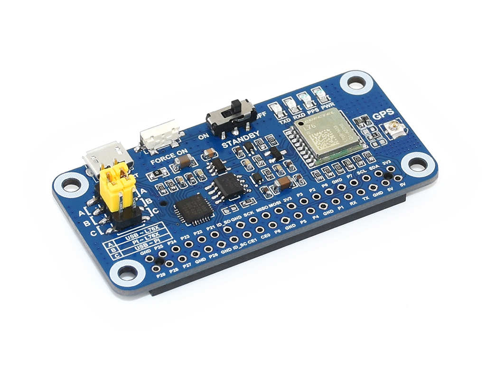

# Pan-Tilt HAT  
## waveshare electronics

http://www.waveshare.net  
https://www.waveshare.com  

## 中文 ## 
http://www.waveshare.net/shop/L76X-GPS-HAT.htm 
具有GNSS(全球导航卫星系统)功能的树莓派扩展板，支持GPS、北斗(BDS)和QZSS多重卫星系统，具有定位快、定位准确和低功耗等优点。

注意：
上传的仅为树莓派驱动程序。

## English ##
http://www.waveshare.com/shop/L76X-GPS-HAT.htm
XXXXXX

note:
Uploaded only for the Raspberry Pi driver.

